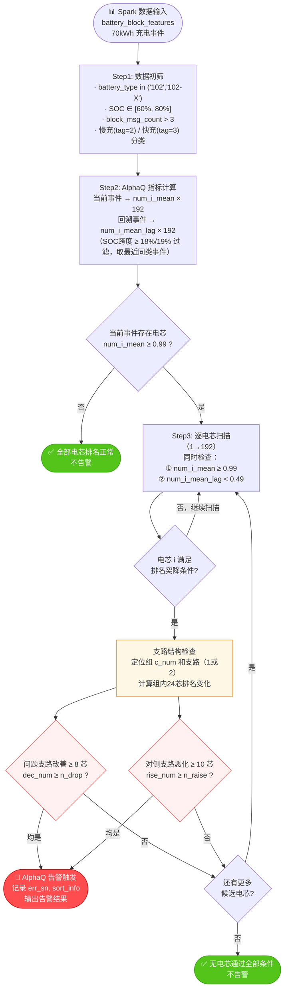

# AlphaQ 压差离群预警算法设计文档

> **算法名称**：电池压差离群预警_统计模型_AlphaQ  
> **监控模式**：7×24h 离线预警  
> **数据来源**：block（dm_battery_compass.d_i_battery_block_features）  
> **适用范围**：仅 70kWh 电池（battery_type in ('102', '102-X')）  
> **算法ID**：Algorithm_4e90fc8f12  
> **版本**：V1.0  

---

## 目录

1. [算法概述](#1-算法概述)
2. [参数配置](#2-参数配置)
3. [电池包结构说明](#3-电池包结构说明)
4. [完整逻辑设计](#4-完整逻辑设计)
5. [核心逻辑流程图](#5-核心逻辑流程图)
6. [输出规范](#6-输出规范)
7. [后续工作计划](#7-后续工作计划)

---

## 1. 算法概述

AlphaQ 通过比较同一电池在两次充电事件（当前 vs 回溯）中各电芯的**充电排名变化**，识别出存在自放电异常的单体电芯。

**核心直觉**：一颗持续自放电的电芯，在充电过程中其 SOC 始终低于同组电芯 → 充电排名（按电压高低）长期垫底（排名值趋近 1）。与上次同类型充电相比，该电芯的排名出现明显突降（回溯时曾排名正常）。同时，由于电池组内电流补偿效应，该电芯所在支路的其他电芯排名会集体改善，对侧支路则集体恶化，形成可识别的支路对称模式。

**关键特征**：
- 仅适用于 70kWh 电池，依赖 192 芯的充电排名特征
- 检测粒度为「充电事件级」而非逐帧，对采样抖动鲁棒
- 需要同类型（慢充/快充）的历史充电事件对照，无回溯事件则无法判定

**性能要求**：离线日批任务，T+1 延迟

---

## 2. 参数配置

以下参数来自《模型参数文档》·电池压差离群预警_统计模型_AlphaQ V1.0：

| 参数名 | 变量名 | V1.0 值 | 单位 | 用途 |
|--------|--------|---------|------|------|
| 当前事件排名阈值 | `cell_rank_mean_limit` | `0.99` | — | 电芯平均排名 ≥ 此值判为疑似问题 |
| 回溯事件排名阈值 | `cell_rank_mean_lag_limit` | `0.49` | — | 回溯排名 < 此值确认历史正常 |
| 同支路改善数下限 | `n_drop` | `8` | 个 | 问题支路排名改善电芯数 |
| 对侧支路恶化数下限 | `n_raise` | `10` | 个 | 对侧支路排名恶化电芯数 |
| SOC窗口下限 | `soc_low` | `60` | % | 采样SOC区间下界 |
| SOC窗口上限 | `soc_high` | `80` | % | 采样SOC区间上界 |
| 事件最小SOC跨度 | `soc_gap` | `18` | % | 当前事件有效性过滤 |
| 回溯事件最小SOC跨度 | `back_event_soc_gap` | `19` | % | 回溯事件有效性过滤 |
| 慢充起始SOC上限 | `scg_start_soc` | `30` | % | 慢充事件筛选条件 |
| 回溯天数 | `back_date_limit` | `30` | 天 | 回溯窗口长度 |
| block消息数下限 | `block_msg_counter_limit` | `3` | 条 | 过滤数据量过少的block |
| 快慢充分界电流 | `current_limit` | `200` | A | 绝对值 < 200A 为慢充（tag=2） |

### 参数解析

```
cell_rank_mean_limit = 0.99
  含义：电芯在充电 SOC[60%,80%] 区间内的平均充电排名 ≥ 0.99
        等价于"几乎总是排名垫底"
  排名归一化：1 = 充电最慢（电压最低），0 = 充电最快（电压最高）

cell_rank_mean_lag_limit = 0.49
  含义：在回溯充电事件中，该电芯的平均排名 < 0.49
        等价于"上次充电时排名中等偏好"
  组合意义：当前垫底 + 回溯正常 → 排名出现突降，提示近期出现异常

n_drop = 8
  含义：问题电芯所在支路（12芯）中，当前事件排名比回溯改善的电芯数 ≥ 8
        "改善"= current_rank - lag_rank < 0（排名值减小，充电更好）

n_raise = 10
  含义：对侧支路（12芯）中，当前事件排名比回溯恶化的电芯数 ≥ 10
        "恶化"= current_rank - lag_rank > 0（排名值增大，充电相对变差）
```

---

## 3. 电池包结构说明

70kWh 电池包（battery_type='102'/'102-X'）的电芯组织结构：

```
总电芯：192 个
组织方式：8 组（block）× 24 芯/组
每组内部：2 条支路并联，每支路 12 芯串联

电芯编号（1-indexed）：
  第0组：电芯   1 ~ 24
    支路1（branch 1）：电芯  1 ~ 12
    支路2（branch 2）：电芯 13 ~ 24
  第1组：电芯  25 ~ 48
    支路1：电芯 25 ~ 36
    支路2：电芯 37 ~ 48
  ...
  第7组：电芯 169 ~ 192
    支路1：电芯 169 ~ 180
    支路2：电芯 181 ~ 192

判定规则（cell i 属于哪个组和支路）：
  c_num（0-indexed）= i // 24         （若 i%24 == 0 则减1）
  pos_in_group      = i - c_num * 24  （1 ~ 24）
  branch            = 1 if pos_in_group ≤ 12 else 2
```

**两支路电流分配关系**：充电时，若支路1中某电芯因自放电导致SOC偏低，充电器会向支路1补充更多电流以平衡。结果是：
- 支路1其他电芯：充电电量增加 → 排名改善（rank 值减小）
- 支路2：充电电量相对减少 → 排名恶化（rank 值增大）

这正是 n_drop / n_raise 指标的物理基础。

---

## 4. 完整逻辑设计

### Step 1：数据初筛

在 Spark 端按以下条件过滤原始 block 数据（此步骤在聚合阶段完成，Python 模型接收已过滤的聚合数据）：

```
筛选条件：
  battery_type in ('102', '102-X')   -- 仅 70kWh 电池
  event_type = 'charge'              -- 充电事件
  block_msg_count > block_msg_counter_limit (=3)  -- 数据量充足
  size(volt_rank_mean) > 1           -- 排名数组非空
  start_user_soc ∈ [soc_low, soc_high]   -- SOC区间 [60%, 80%]
  end_user_soc   ∈ [soc_low, soc_high]
  charge_mode_tag 赋值：
    abs(avg_charge_current) < current_limit (200A) → 2（慢充）
    否则 → 3（快充）
  慢充附加：event_start_soc ≤ scg_start_soc (30%)  -- 慢充从低SOC开始
```

---

### Step 2：AlphaQ 指标计算

对筛选后的事件数据计算核心指标：

#### 2.1 当前事件聚合

```
按 (battery_id, device_id, process_id, battery_type, event_type, charge_mode_tag) 分组

对每个电芯 i（1~192）：
  num_i_mean = mean(volt_rank_mean[i-1])   -- SOC[60,80]区间内所有 block 帧的排名均值

附加条件过滤：
  delt_soc = max(end_soc) - min(start_soc) ≥ soc_gap (18%)  -- SOC跨度充足
  存在电芯 i 使得 num_i_mean ≥ cell_rank_mean_limit (0.99)   -- 至少1个电芯长期垫底
```

#### 2.2 回溯事件聚合

```
回溯窗口：[input_date - back_date_limit, input_date]，即最近30天
同类型事件：charge_mode_tag 匹配

按同方式分组，取最近第2次（row_number=2，跳过当天）充电事件作为对照：
  num_i_mean_lag：回溯事件中电芯 i 的平均排名

回溯事件附加条件：
  delt_soc_lag ≥ back_event_soc_gap (19%)  -- 回溯事件SOC跨度充足
```

---

### Step 3：综合判定

对当前事件 × 回溯事件匹配后的每一行数据，逐电芯执行以下判定（Python 模型中的 `detect` 方法）：

#### 3.1 排名突降条件

```
对每个电芯 i（1 ~ 192），同时满足：
  num_i_mean     ≥ cell_rank_mean_limit     (= 0.99)   -- 当前排名极差
  num_i_mean_lag <  cell_rank_mean_lag_limit (= 0.49)   -- 回溯排名曾正常

不满足则跳过，继续下一个电芯
```

#### 3.2 支路结构检查

对满足排名突降条件的电芯 i，执行支路对称性验证：

```
1. 确定所在组 c_num 和支路：
   c_num = i // 24（若 i%24=0 则减1）
   branch = 1 if (i - c_num*24) ≤ 12 else 2

2. 计算组内排名变化（c1_changes, c2_changes）：
   c1_changes[j] = num_{c_num*24+j}_mean - num_{c_num*24+j}_mean_lag  (j=1..12)
   c2_changes[j] = num_{c_num*24+12+j}_mean - num_{c_num*24+12+j}_mean_lag  (j=1..12)
   正值 = 排名恶化，负值 = 排名改善

3. 按问题电芯所在支路分类计算：
   若 branch = 1（问题电芯在支路1）：
     dec_num  = count(c1_changes[j] < 0)  -- 支路1排名改善电芯数
     rise_num = count(c2_changes[j] > 0)  -- 支路2排名恶化电芯数
   若 branch = 2（问题电芯在支路2）：
     dec_num  = count(c2_changes[j] < 0)  -- 支路2排名改善电芯数
     rise_num = count(c1_changes[j] > 0)  -- 支路1排名恶化电芯数

4. 综合判定（同时满足）：
   dec_num  ≥ n_drop  (= 8)   →  问题支路集体改善
   rise_num ≥ n_raise (= 10)  →  对侧支路集体恶化
```

#### 3.3 告警触发

```
若 3.1 和 3.2 均满足 → alarm_state = 1，记录问题电芯 sn，输出告警
扫描顺序：电芯 1 → 192，取首个满足条件的电芯作为告警原因

去重机制：
  与前一天的 AlphaQ 告警比较，result_data_time 相同的视为重复，不重复触发
```

---

## 5. 核心逻辑流程图



---

## 6. 输出规范

### 6.1 告警字段（alarm_data JSON）

| 字段 | 类型 | 说明 |
|------|------|------|
| `battery_id` | str | 电池编号 |
| `device_id` | str | 设备编号 |
| `device_name` | str | 设备名称 |
| `time_stamp` | int | 告警时间戳（ms） |
| `process_id` | str | 当前充电事件ID |
| `process_id_lag` | str | 回溯充电事件ID |
| `charge_mode_tag` | int | 充电类型（2=慢充, 3=快充） |
| `charge_mode_tag_lag` | int | 回溯事件充电类型 |
| `volt_diff_mean` | float | 当前事件平均压差（mV） |
| `volt_diff_mean_lag` | float | 回溯事件平均压差（mV） |
| `avg_charge_current` | float | 当前事件平均充电电流（A） |
| `avg_charge_current_lag` | float | 回溯事件平均充电电流（A） |
| `start_time` | str | 当前事件开始时间 |
| `start_time_lag` | str | 回溯事件开始时间 |
| `err_sn` | str | 问题电芯编号（"255"=无问题） |
| `volt_sort_info` | str | 当前事件组内24芯排名列表 |
| `volt_sort_lag_info` | str | 回溯事件组内24芯排名列表 |

### 6.2 Python 模型输出（AlarmResult）

| 字段 | 类型 | 说明 |
|------|------|------|
| `alarm_triggered` | bool | 是否触发告警 |
| `err_sn` | Optional[int] | 问题电芯编号（1-192），None=未触发 |
| `triggered_group` | Optional[int] | 所在组（0-7） |
| `triggered_branch` | Optional[int] | 所在支路（1 或 2） |
| `dec_num` | int | 同支路改善电芯数 |
| `rise_num` | int | 对侧支路恶化电芯数 |
| `err_rank_mean` | float | 问题电芯当前事件排名 |
| `err_rank_mean_lag` | float | 问题电芯回溯事件排名 |
| `err_rank_change` | float | 排名变化量（current - lag） |
| `sort_info` | List[float] | 组内24芯当前排名 |
| `sort_lag_info` | List[float] | 组内24芯回溯排名 |
| `margins` | Dict | 各关键条件裕度（供Skill分析） |
| `candidate_cells` | List[CandidateCell] | 满足排名突降但支路检查未通过的候选电芯 |
| `n_cells_rank_ge_99/95/90` | int | 高排名电芯数统计 |
| `max_rank_mean` | float | 全局最大排名值 |

---

## 7. 后续工作计划

- [ ] **Step 1**：接入真实历史漏报/误报案例数据，运行 `alphaq_vdiff.py` 验证复现结果
- [ ] **Step 2**：基于案例分析结果，评估 `cell_rank_mean_limit`（当前0.99）是否过严
- [ ] **Step 3**：评估 `n_drop`（8）和 `n_raise`（10）的支路检查阈值合理性
- [ ] **Step 4**：对比慢充（tag=2）和快充（tag=3）的告警分布，评估是否需要分类配置参数
- [ ] **Step 5**：输出调优后参数版本 V1.1

---

*文档生成时间：2026-05-22*  
*参数来源：《模型参数文档》· 电池压差离群预警_统计模型_AlphaQ（Algorithm_4e90fc8f12）*  
*逻辑来源：生产代码 `generate_alarm_detail` / `generate_battery_alarm_info`*
